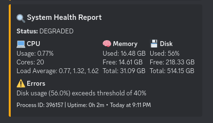
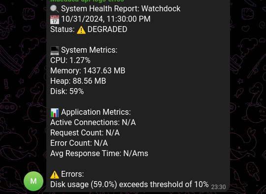

# Watchdock 🔍

[](https://www.npmjs.com/package/watchdock)
[](https://opensource.org/licenses/MIT)
[](https://www.typescriptlang.org/)
[](https://www.npmjs.com/package/watchdock)

A powerful and flexible system monitoring library for Node.js applications with built-in support for multiple notification providers.

## ✨ Features

- 📊 **System Metrics Monitoring**
  - CPU usage and load
  - Memory utilization
  - Disk space
  - Process information
- 🚨 **Multiple Notification Providers**
  - Discord webhooks
  - Telegram bots
  - Email notifications
- ⚙️ **Advanced Configuration**
  - Customizable monitoring intervals
  - Flexible threshold settings
  - Duration-based alerts
  - Custom metrics support
- 🛡️ **Reliability**
  - Error handling
  - Retry mechanisms
  - Graceful failure handling

## 📦 Installation

```bash
# Using npm
npm install watchdock

# Using yarn
yarn add watchdock

# Using pnpm
pnpm add watchdock
```

## 🚀 Quick Start

```typescript
import { SystemMonitor } from 'watchdock';

const monitor = new SystemMonitor({
  interval: '*/5 * * * *', // Check every 5 minutes
  application: {
    name: 'HAMORA API',
    metadata: {
      version: '1.0.0',
    },
  },
  providers: [
    {
      type: 'discord',
      webhookUrl: 'your-discord-webhook-url',
    },
    {
      type: 'telegram',
      botToken: 'your-telegram-bot-token',
      chatId: 'your-chat-id',
    },
  ],
  notifications: {
    cpu: {
      value: 80, // Notify when CPU > 80%
      duration: 5, // Must exceed for 5 minutes
      notify: true,
    },
    memory: {
      value: 90, // Notify when memory > 90%
      notify: true,
    },
    disk: {
      value: 95, // Notify when disk > 95%
      notify: true,
    },
    status: {
      notifyOn: ['unhealthy', 'degraded'], // Notify on these states
    },
  },
});

monitor.start();
```

## 📚 Configuration

### Monitor Config Options

```typescript
interface MonitorConfig {
  // Cron expression for monitoring interval
  interval: string;

  // Array of notification providers
  providers: NotificationConfig[];

  // Optional environment name
  env?: string;

  // Optional custom metrics collector
  customMetrics?: () => Promise<ApplicationMetrics>;

  // Notification rules
  notifications?: NotificationRules;
}
```

### Notification Providers

#### Discord

```typescript
{
  type: "discord",
  webhookUrl: "your-webhook-url",
  username?: "Custom Bot Name",
  avatarUrl?: "https://your-avatar-url.com/image.png"
}
```

#### Telegram

```typescript
{
  type: "telegram",
  botToken: "your-bot-token",
  chatId: "your-chat-id"
}
```

#### Email

```typescript
{
  type: "email",
  host: "smtp.example.com",
  port: 587,
  secure: true,
  auth: {
    user: "your-email@example.com",
    pass: "your-password"
  },
  from: "monitor@example.com",
  to: ["admin@example.com"]
}
```

### Custom Metrics

You can add your own application metrics:

```typescript
const monitor = new SystemMonitor({
  // ... other config
  customMetrics: async () => ({
    activeConnections: await getActiveConnections(),
    requestCount: await getRequestCount(),
    errorRate: await calculateErrorRate(),
    responseTime: await getAverageResponseTime(),
  }),
});
```

## 📊 Metrics Format

The monitoring system collects and reports the following metrics:

```typescript
interface MetricsReport {
  timestamp: string;
  status: 'healthy' | 'degraded' | 'unhealthy';
  errors: string[];
  system: {
    cpu: {
      usage: number;
      count: number;
      loadAvg: number[];
    };
    memory: {
      total: number;
      free: number;
      used: number;
      heapTotal: number;
      heapUsed: number;
      external: number;
      rss: number;
    };
    disk: {
      total: number;
      free: number;
      used: number;
      usedPercentage: number;
    };
    process: {
      uptime: number;
      pid: number;
      version: string;
    };
  };
  application: ApplicationMetrics;
}
```

## 🔔 Notification Examples

### Discord Notification



### Telegram Notification



## 🛠️ Advanced Usage

### Duration-Based Alerts

```typescript
notifications: {
  cpu: {
    value: 80,
    duration: 5, // Only alert if CPU > 80% for 5+ minutes
    notify: true
  }
}
```

## 📝 Contributing

Contributions are welcome! Please feel free to submit a Pull Request. For major changes, please open an issue first to discuss what you would like to change.

1. Fork the repository
2. Create your feature branch (`git checkout -b feature/AmazingFeature`)
3. Commit your changes (`git commit -m 'Add some AmazingFeature'`)
4. Push to the branch (`git push origin feature/AmazingFeature`)
5. Open a Pull Request

## 📄 License

This project is licensed under the MIT License - see the [LICENSE](LICENSE) file for details.

## 👤 Author

**Rafael Batista Santos**

- Github: [@raphab3](https://github.com/raphab3)
- LinkedIn: [@rafael-batista-santos](https://linkedin.com/in/rafael-batista-79b106bb/)

## 🤝 Support

Give a ⭐️ if this project helped you!

---

Built with ❤️ by [Rafael Batista Santos](https://github.com/raphab3)
